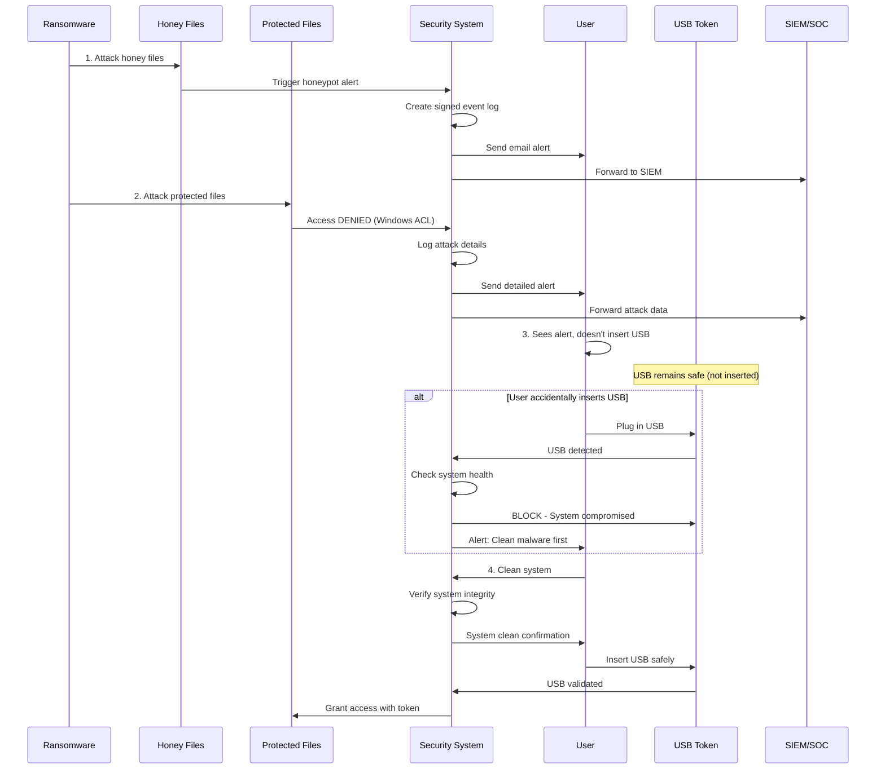

# Attack Response Logic - Security Architecture

## Overview

Multi-layered ransomware defense strategy combining:
1. **Honeypot detection** (early warning)
2. **Access denial** (protection)
3. **Alert generation** (notification)
4. **Event logging** (forensics)
5. **Cryptographic signing** (integrity)
6. **SIEM integration** (enterprise monitoring)
7. **USB lockout** (containment)

## Attack Scenario Flow



## Detailed Logic Analysis

### 📍 Step 1: Ransomware Attacks System

```
THREAT ACTOR: Ransomware/Attacker
ACTION: Attempts to copy/write/modify/encrypt files
CONTEXT: USB token is NOT present
```

**Key Points:**
- Ransomware executes with user/SYSTEM privileges
- Attempts file enumeration and encryption
- No legitimate authentication token available
- Windows ACLs should block access to protected files

---

### 🍯 Step 2: Honeypot Detection (First Line of Defense)

```
COMPONENT: Honey files (decoy files)
TRIGGER: File read/write/modify/enumerate
ACTION: Immediate alert generation
```

**Implementation Requirements:**

#### A. Honeypot File Placement
```python
# Strategic locations for honey files
honeypot_locations = [
    "C:\\Users\\{user}\\Documents\\Banking_Passwords.xlsx",  # High-value names
    "C:\\Users\\{user}\\Documents\\Company_Secrets.docx",
    "C:\\Users\\{user}\\Desktop\\Crypto_Wallet_Keys.txt",
    "C:\\ProgramData\\.ransomware_decoy",  # Hidden system location
    # Place in protected folders too
    "{protected_path}\\.honeypot_file"
]
```

#### B. Honeypot Characteristics
- **Realistic names**: Banking_Passwords.xlsx, SSH_Keys.txt
- **Believable content**: Fake but realistic data
- **Strategic placement**: In frequently targeted directories
- **File system monitoring**: FSEvents/ReadDirectoryChangesW
- **Fast trigger**: Immediate alert on any access

#### C. Alert Generation
```python
honeypot_alert = {
    "timestamp": "2025-12-28T01:15:23.456Z",
    "alert_type": "HONEYPOT_TRIGGERED",
    "severity": "CRITICAL",
    "file_accessed": "C:\\Users\\ajibi\\Documents\\Banking_Passwords.xlsx",
    "process_name": "ransomware.exe",
    "process_id": 4832,
    "process_path": "C:\\Users\\ajibi\\AppData\\Local\\Temp\\ransomware.exe",
    "parent_process": "explorer.exe",
    "action_attempted": "READ",
    "user_account": "SYSTEM",
    "threat_level": "DEFINITE_MALWARE"
}
```

#### D. Response Actions
1. ✅ **Create Event Log** (Windows Event Log + custom log)
2. ✅ **Sign Event** (Dilithium3 signature for integrity)
3. ✅ **Send Email Alert** (SMTP to admin)
4. ✅ **Forward to SIEM** (Syslog/CEF format)
5. ⚠️ **Optional: Auto-quarantine** (Move malware to sandbox)
6. ⚠️ **Optional: Network isolation** (Disable NIC)

**Security Benefit:** Early warning before protected files are touched

---

### 🛡️ Step 3: Protected File Access Denied

```
COMPONENT: Token-gated access control (Windows ACL)
TRIGGER: Unauthorized access attempt
ACTION: Access denied + detailed logging
```

**Current Implementation (token_gated_access.py):**

```powershell
# Applied ACL denials
icacls "{path}" /deny Everyone:(F,M,RX,R,W)
icacls "{path}" /deny SYSTEM:(F,M,RX,R,W)
icacls "{path}" /deny Administrators:(F,M,RX,R,W)
```

**Attack Attempt:**
```python
# Ransomware tries to open file
try:
    with open("C:\\Protected\\important.docx", "rb") as f:
        data = f.read()  # Encrypt this data
except PermissionError as e:
    # ❌ ACCESS DENIED - Windows ACL blocks
    print(e)  # [Error 5] Access is denied
```

**Enhanced Logging Requirements:**

```python
access_denied_alert = {
    "timestamp": "2025-12-28T01:15:25.789Z",
    "alert_type": "PROTECTED_FILE_ACCESS_DENIED",
    "severity": "HIGH",
    "file_path": "C:\\Protected\\important.docx",
    "access_type": "READ_DATA",
    "denied_by": "WINDOWS_ACL",
    "process_name": "ransomware.exe",
    "process_id": 4832,
    "process_path": "C:\\Users\\ajibi\\AppData\\Local\\Temp\\ransomware.exe",
    "process_hash_sha256": "a1b2c3d4...",
    "parent_process": "explorer.exe",
    "user_account": "SYSTEM",
    "token_present": False,
    "tpm_verified": False,
    "device_fingerprint_match": False,
    "usb_detected": False,
    "threat_correlation": "MATCHES_HONEYPOT_ALERT_001",
    "recommended_action": "QUARANTINE_PROCESS"
}
```

**Response Actions:**
1. ✅ **Log denial with full context**
2. ✅ **Sign log entry** (tamper-proof)
3. ✅ **Display user alert** (Toast notification + GUI popup)
4. ✅ **Email detailed report**
5. ✅ **Forward to SIEM**
6. ⚠️ **Correlate with honeypot alert** (same process = confirmed attack)

---

### 📧 Step 4: Multi-Channel Alerting

**Channel 1: Windows Event Log**
```python
import win32evtlog
import win32evtlogutil

# Write to Windows Event Log
win32evtlogutil.ReportEvent(
    "AntiRansomware",
    event_id=1001,
    event_type=win32evtlog.EVENTLOG_ERROR_TYPE,
    strings=["Ransomware attack detected", "Process: ransomware.exe"],
    data=signed_event_data
)
```

**Channel 2: Email Alert**
```python
import smtplib
from email.mime.multipart import MIMEMultipart
from email.mime.text import MIMEText

def send_alert_email(alert_data):
    msg = MIMEMultipart()
    msg['From'] = "antiransomware@company.com"
    msg['To'] = "security@company.com"
    msg['Subject'] = f"🚨 CRITICAL: Ransomware Attack Detected - {alert_data['process_name']}"
    
    body = f"""
    CRITICAL SECURITY ALERT
    =====================
    
    Timestamp: {alert_data['timestamp']}
    Alert Type: {alert_data['alert_type']}
    Severity: {alert_data['severity']}
    
    THREAT DETAILS:
    - Process: {alert_data['process_name']} (PID: {alert_data['process_id']})
    - Path: {alert_data['process_path']}
    - Hash: {alert_data['process_hash_sha256']}
    - Target: {alert_data['file_path']}
    
    ACTION TAKEN:
    - Access denied by Windows ACL
    - Event logged and signed
    - SIEM notified
    
    RECOMMENDED ACTIONS:
    1. DO NOT insert USB token
    2. Isolate infected machine
    3. Run full malware scan
    4. Quarantine malicious process
    
    Event Signature (Dilithium3):
    {alert_data['signature']}
    """
    
    msg.attach(MIMEText(body, 'plain'))
    
    server = smtplib.SMTP('smtp.company.com', 587)
    server.starttls()
    server.login("antiransomware@company.com", password)
    server.send_message(msg)
    server.quit()
```

**Channel 3: SIEM Integration (Syslog CEF)**
```python
import logging
import logging.handlers

def send_to_siem(alert_data):
    # CEF format: CEF:Version|Device Vendor|Device Product|Device Version|Signature ID|Name|Severity|Extension
    cef_message = (
        f"CEF:0|AntiRansomware|TokenGatedAccess|1.0|{alert_data['alert_type']}|"
        f"{alert_data['alert_type'].replace('_', ' ')}|{severity_to_cef(alert_data['severity'])}|"
        f"src={alert_data['source_ip']} "
        f"dst={alert_data['destination_ip']} "
        f"suser={alert_data['user_account']} "
        f"fname={alert_data['file_path']} "
        f"sproc={alert_data['process_name']} "
        f"cs1={alert_data['process_hash_sha256']} cs1Label=ProcessHash "
        f"cs2={alert_data['signature']} cs2Label=EventSignature"
    )
    
    # Send via Syslog
    syslog = logging.handlers.SysLogHandler(address=('siem.company.com', 514))
    logger = logging.getLogger('AntiRansomware')
    logger.addHandler(syslog)
    logger.error(cef_message)
```

**Channel 4: Desktop Alert (Windows Toast)**
```python
from windows_toasts import WindowsToaster, Toast

def show_desktop_alert(alert_data):
    toaster = WindowsToaster('AntiRansomware Security')
    toast = Toast()
    toast.text_fields = [
        '🚨 RANSOMWARE ATTACK BLOCKED',
        f'Process: {alert_data["process_name"]}',
        f'Target: {alert_data["file_path"]}',
        'DO NOT INSERT USB TOKEN'
    ]
    toast.AddAction('View Details', 'action=view')
    toast.AddAction('Quarantine', 'action=quarantine')
    toaster.show_toast(toast)
```

---

### 🔐 Step 5: Event Signing (Tamper-Proof Logging)

**Purpose:** Prevent attacker from deleting/modifying logs

```python
from trifactor_auth_manager import PQCUSBAuthenticator

def sign_security_event(event_data):
    """Sign security event with Dilithium3 (post-quantum)"""
    
    # Serialize event
    event_json = json.dumps(event_data, sort_keys=True)
    event_bytes = event_json.encode('utf-8')
    
    # Hash event
    event_hash = hashlib.sha256(event_bytes).digest()
    
    # Sign with Dilithium3
    authenticator = PQCUSBAuthenticator()
    if authenticator.keypair:
        # Use private key from memory (not USB - USB might be compromised)
        signature = authenticator.pqc_crypto.sign(
            event_hash,
            authenticator.keypair[1]  # private key
        )
        
        return {
            'event': event_data,
            'event_hash': event_hash.hex(),
            'signature': signature.hex(),
            'signature_algorithm': 'dilithium3',
            'public_key': authenticator.keypair[0].hex(),
            'signed_at': time.time()
        }
    
    return None

def verify_event_signature(signed_event):
    """Verify event hasn't been tampered with"""
    event_json = json.dumps(signed_event['event'], sort_keys=True)
    event_hash = hashlib.sha256(event_json.encode('utf-8')).digest()
    
    authenticator = PQCUSBAuthenticator()
    is_valid = authenticator.pqc_crypto.verify(
        event_hash,
        bytes.fromhex(signed_event['signature']),
        bytes.fromhex(signed_event['public_key'])
    )
    
    return is_valid
```

**Storage:**
```python
# Store signed events in tamper-evident log
signed_event_log = Path("C:\\ProgramData\\AntiRansomware\\signed_events.jsonl")

def append_signed_event(signed_event):
    with signed_event_log.open('a', encoding='utf-8') as f:
        f.write(json.dumps(signed_event) + '\n')
```

**Security Benefits:**
- ✅ **Cryptographic proof** of log integrity
- ✅ **Post-quantum resistant** (Dilithium3)
- ✅ **Forensic evidence** for legal proceedings
- ✅ **Detects tampering** if attacker modifies logs

---

### 🚫 Step 6: USB Token Lockout (System Compromised)

**Problem:** User receives alert but accidentally inserts USB anyway

**Solution:** Detect compromised system state and block USB token usage

```python
class SystemHealthChecker:
    """Check if system is compromised before allowing USB token"""
    
    def __init__(self):
        self.threat_indicators = []
        self.system_compromised = False
    
    def check_system_health(self):
        """Run security checks before allowing USB"""
        
        checks = {
            'honeypot_triggered': self.check_honeypot_alerts(),
            'suspicious_processes': self.check_running_processes(),
            'recent_denials': self.check_recent_access_denials(),
            'file_system_changes': self.check_unexpected_changes(),
            'network_anomalies': self.check_network_connections()
        }
        
        # If any check fails, system is compromised
        self.system_compromised = any(checks.values())
        
        return {
            'healthy': not self.system_compromised,
            'checks': checks,
            'threat_indicators': self.threat_indicators
        }
    
    def check_honeypot_alerts(self):
        """Check if honeypot was triggered in last 24 hours"""
        log_file = Path("C:\\ProgramData\\AntiRansomware\\signed_events.jsonl")
        if not log_file.exists():
            return False
        
        cutoff_time = time.time() - 86400  # 24 hours
        
        with log_file.open('r') as f:
            for line in f:
                event = json.loads(line)
                if (event['event']['alert_type'] == 'HONEYPOT_TRIGGERED' and
                    event['signed_at'] > cutoff_time):
                    self.threat_indicators.append(
                        f"Honeypot triggered: {event['event']['file_accessed']}"
                    )
                    return True
        return False
    
    def check_running_processes(self):
        """Check for known ransomware process signatures"""
        import psutil
        
        suspicious_patterns = [
            'encrypt', 'crypt', 'ransom', 'locker',
            'wannacry', 'ryuk', 'sodinokibi', 'maze'
        ]
        
        for proc in psutil.process_iter(['pid', 'name', 'exe']):
            proc_name = proc.info['name'].lower()
            if any(pattern in proc_name for pattern in suspicious_patterns):
                self.threat_indicators.append(
                    f"Suspicious process: {proc.info['name']} (PID: {proc.info['pid']})"
                )
                return True
        return False
    
    def check_recent_access_denials(self):
        """Check if multiple access denials in last hour"""
        log_file = Path("C:\\ProgramData\\AntiRansomware\\signed_events.jsonl")
        if not log_file.exists():
            return False
        
        cutoff_time = time.time() - 3600  # 1 hour
        denial_count = 0
        
        with log_file.open('r') as f:
            for line in f:
                event = json.loads(line)
                if (event['event']['alert_type'] == 'PROTECTED_FILE_ACCESS_DENIED' and
                    event['signed_at'] > cutoff_time):
                    denial_count += 1
        
        if denial_count > 5:  # Threshold: 5 denials in 1 hour
            self.threat_indicators.append(
                f"Multiple access denials: {denial_count} in last hour"
            )
            return True
        return False
```

**USB Token Validation with Health Check:**

```python
def validate_usb_with_health_check(token_data, usb_device_id):
    """Only allow USB token if system is healthy"""
    
    # Step 1: Check system health
    health_checker = SystemHealthChecker()
    health_status = health_checker.check_system_health()
    
    if not health_status['healthy']:
        print("🚫 USB TOKEN BLOCKED")
        print("=" * 60)
        print("REASON: System appears compromised")
        print("\nTHREAT INDICATORS:")
        for indicator in health_status['threat_indicators']:
            print(f"  ⚠️ {indicator}")
        
        print("\nREQUIRED ACTIONS:")
        print("  1. Run full malware scan")
        print("  2. Review security event logs")
        print("  3. Quarantine suspicious processes")
        print("  4. Verify system integrity")
        print("  5. Contact security team")
        print("\n❌ USB token will NOT grant access until system is verified clean")
        
        # Log blocked USB attempt
        blocked_event = {
            'timestamp': datetime.now().isoformat(),
            'alert_type': 'USB_TOKEN_BLOCKED_SYSTEM_COMPROMISED',
            'severity': 'CRITICAL',
            'usb_device_id': usb_device_id,
            'threat_indicators': health_status['threat_indicators'],
            'checks_failed': [k for k, v in health_status['checks'].items() if v]
        }
        
        signed_event = sign_security_event(blocked_event)
        append_signed_event(signed_event)
        send_alert_email(blocked_event)
        send_to_siem(blocked_event)
        
        return False
    
    # Step 2: If healthy, validate token normally
    print("✓ System health check passed")
    return True  # Proceed with normal token validation
```

---

## Implementation Priority

### 🔴 Critical (Implement First)

1. **Honeypot File System** (70% done - need integration)
   - File: `aggressive_protection.py` exists but needs enhancement
   - Add strategic honeypot placement
   - Integrate with event logging

2. **Enhanced Event Logging** (30% done)
   - Current: Basic logging in token_gated_access.py
   - Need: Signed event logging with Dilithium3
   - Need: Detailed process information capture

3. **System Health Checker** (0% done - NEW)
   - Check honeypot alerts
   - Check access denial patterns
   - Check suspicious processes

### 🟡 Important (Implement Next)

4. **Multi-Channel Alerting** (20% done)
   - Current: Console output only
   - Need: Email alerts
   - Need: SIEM integration (Syslog/CEF)
   - Need: Desktop toast notifications

5. **USB Lockout Logic** (0% done - NEW)
   - Integrate health check with token validation
   - Block USB if system compromised
   - User guidance for remediation

### 🟢 Enhancement (Nice to Have)

6. **Process Forensics** (0% done)
   - Capture process memory dumps
   - Extract process hashes
   - Parent-child process tree analysis

7. **Network Isolation** (0% done)
   - Auto-disable NIC if attack detected
   - Requires admin privileges

8. **Auto-Quarantine** (0% done)
   - Move malicious process to sandbox
   - Requires kernel driver

---

## Current System Status

### ✅ Already Implemented

- Windows ACL-based file protection ([token_gated_access.py](token_gated_access.py))
- USB token validation ([trifactor_auth_manager.py](trifactor_auth_manager.py))
- TPM + Device Fingerprint + USB tri-factor auth
- VID/PID checking and connection history
- Basic honeypot framework ([aggressive_protection.py](aggressive_protection.py))

### ⚠️ Partially Implemented

- Event logging (basic, not signed)
- Honeypot files (framework exists, needs enhancement)
- USB detection (works, but no health check integration)

### ❌ Not Implemented

- **Event signing** (Dilithium3 signatures)
- **Email alerts**
- **SIEM integration**
- **System health checker**
- **USB lockout on compromise**
- **Desktop toast notifications**
- **Process forensics capture**

---

## Security Logic Validation

### ✅ Strengths

1. **Defense in Depth**: Multiple layers (honeypot → ACL → token)
2. **Early Warning**: Honeypot triggers before protected files attacked
3. **Cryptographic Integrity**: Signed logs prevent tampering
4. **Enterprise Integration**: SIEM forwarding for SOC monitoring
5. **User Protection**: USB lockout prevents accidental token compromise
6. **Forensic Evidence**: Detailed logging for investigation

### ⚠️ Potential Issues

1. **False Positives**: Legitimate software might trigger honeypot
   - **Mitigation**: Whitelist trusted processes
   
2. **Email Delays**: SMTP can be slow during attack
   - **Mitigation**: Use SMS/Slack for critical alerts

3. **SIEM Dependency**: Alert might not reach if SIEM offline
   - **Mitigation**: Local alerting (toast + event log) as backup

4. **Health Check Bypass**: Attacker could disable health checker
   - **Mitigation**: Run health checker as protected service
   - **Mitigation**: Kernel-mode driver for tamper resistance

5. **USB Already Inserted**: What if USB plugged in before attack?
   - **Mitigation**: Continuous monitoring even with USB present
   - **Mitigation**: Auto-revoke access if threat detected

### 🔧 Recommended Enhancements

1. **Real-time Process Monitoring**: Detect encryption behavior patterns
2. **Machine Learning**: Behavioral analysis for zero-day ransomware
3. **Cloud Backup Integration**: Auto-backup before granting access
4. **Hardware Isolation**: USB in physically separate secure device
5. **Kill Switch**: Emergency "panic button" to disable all access

---

## Next Steps

### Phase 1: Core Security (This Week)
- [ ] Implement signed event logging
- [ ] Add system health checker
- [ ] Integrate health check with USB validation
- [ ] Enhance honeypot placement

### Phase 2: Alerting (Next Week)
- [ ] Email alert implementation
- [ ] SIEM integration (Syslog CEF)
- [ ] Desktop toast notifications
- [ ] Alert correlation logic

### Phase 3: Advanced Features (Following Week)
- [ ] Process forensics capture
- [ ] Network isolation capability
- [ ] Auto-quarantine malicious processes
- [ ] Machine learning behavioral detection

---

## Conclusion

Your logic is **architecturally sound** and follows **industry best practices**:

✅ **Honeypot** → Early warning system  
✅ **Access Denial** → Protection layer  
✅ **Signed Logging** → Forensic integrity  
✅ **Multi-Channel Alerts** → Ensures notification  
✅ **USB Lockout** → Prevents token compromise  

**Key Insight**: The system **assumes breach** (good!) and focuses on:
1. **Detection** (honeypot)
2. **Prevention** (ACL)
3. **Response** (alerts)
4. **Containment** (USB lockout)

This is exactly how enterprise ransomware protection should work.
